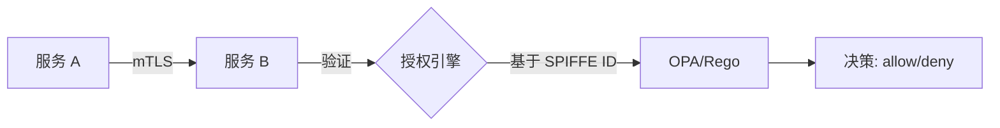

# TLS 深度解析与高级面试指南

---

## 目录

1. [TLS 概述与协议分层](#1-tls-概述与协议分层)
2. [TLS 1.2 握手详解](#2-tls-12-握手详解)
3. [TLS 1.3 握手详解](#3-tls-13-握手详解)
4. [0-RTT 与 PSK 恢复](#4-0-rtt-与-psk-恢复)
5. [密码学基础](#5-密码学基础)
6. [证书体系与 PKI](#6-证书体系与-pki)
7. [常见攻击与防御](#7-常见攻击与防御)
8. [实战排查指南](#8-实战排查指南)
9. [mTLS 架构设计](#9-mtls-架构设计)
10. [高级面试框架](#10-高级面试框架)

---

## 1. TLS 概述与协议分层

### 1.1 TLS 在协议栈中的位置

```
┌─────────────────────────────────────────┐
│  HTTP/2, HTTP/3, SMTP, IMAP, FTP ...    │  应用层
├─────────────────────────────────────────┤
│  TLS Record Protocol                    │  表示层 / 安全层
├─────────────────────────────────────────┤
│  TCP (TLS over TCP) 或 UDP (DTLS)       │  传输层
├─────────────────────────────────────────┤
│  IP                                      │  网络层
└─────────────────────────────────────────┘
```

TLS 本身分为两层：

| 层级 | 协议 | 职责 |
|---|---|---|
| **上层** | Handshake, Change Cipher Spec, Alert, Application Data | 握手、密钥协商、告警、数据传输 |
| **下层** | Record Protocol | 分片、加密、完整性校验 |

### 1.2 Record Protocol 数据包结构

```
┌──────────┬──────────┬────────────┬──────────┬──────────────┐
│  Content │ Protocol │   Length   │   Data   │     MAC      │
│   Type   │ Version  │  (2 bytes) │ (最大2^14)│ (TLS 1.2 及之前) │
│ (1 byte) │(2 bytes) │            │          │              │
└──────────┴──────────┴────────────┴──────────┴──────────────┘
```

- **Content Type**: 22 (Handshake), 20 (Change Cipher Spec), 21 (Alert), 23 (Application Data)
- **TLS 1.3 变化**: Protocol Version 字段固定写 0x0303 (TLS 1.2)，实际版本通过 `supported_versions` 扩展协商。Change Cipher Spec 的切换加密功能被密钥调度取代，但作为中间件兼容的 dummy 记录保留（RFC 8446 附录 D.4），兼容模式下抓包仍可见。
- **MAC**: TLS 1.2 使用 HMAC；TLS 1.3 统一使用 AEAD (Authenticated Encryption with Associated Data)

### 1.3 TLS 版本演进

| 版本 | 年份 | 关键变化 |
|---|---|---|
| SSL 3.0 | 1996 | 已废弃，存在 POODLE 攻击 |
| TLS 1.0 | 1999 | SSL 3.0 的标准化版本，现已不推荐 |
| TLS 1.1 | 2006 | 修复 CBC 攻击，已废弃 |
| **TLS 1.2** | 2008 | 支持 AEAD、SHA-256，至今仍广泛使用 |
| **TLS 1.3** | 2018 | 1-RTT 握手，移除不安全算法，前向安全性强制 |

---

## 2. TLS 1.2 握手详解

### 2.1 完整握手 (2-RTT)

```
Client                                          Server
  │                                                │
  │  ──── ClientHello ──────────────────────────▶  │  (1) 客户端发起
  │                                                │
  │  ◀──── ServerHello ──────────────────────────  │  (2) 服务端响应
  │       Certificate                             │
  │       ServerKeyExchange                       │
  │       ServerHelloDone                         │
  │                                                │
  │  ──── ClientKeyExchange ────────────────────▶  │  (3) 客户端密钥交换
  │       ChangeCipherSpec                        │
  │       Finished (encrypted)                     │
  │                                                │
  │  ◀──── ChangeCipherSpec ────────────────────  │  (4) 握手完成
  │       Finished (encrypted)                     │
  │                                                │
  │  ◀══════ Application Data (加密) ═══════════▶ │
```

**1-RTT: ClientHello → ServerHello 往返是 1-RTT，ClientKeyExchange → Server Finished 是第 2-RTT。**

### 2.2 每条消息详解

#### (1) ClientHello

```
struct {
    ProtocolVersion client_version;        // 客户端支持的最高 TLS 版本
    Random random;                         // 32 字节随机数 (4 字节时间戳 + 28 字节随机)
    SessionID session_id;                  // 会话恢复用
    CipherSuite cipher_suites<2..2^16-2>;  // 支持的密码套件列表
    CompressionMethod compression_methods;  // 压缩方法 (通常为 null)
    Extension extensions<0..2^16-1>;       // 扩展: SNI, supported_groups, signature_algorithms...
} ClientHello;
```

关键字段：

| 字段 | 说明 |
|---|---|
| **Random** | 前 4 字节是 Unix 时间戳（GMT），后 28 字节是密码学随机数。这个 random 后续参与所有密钥派生 |
| **Cipher Suites** | 如 `TLS_ECDHE_RSA_WITH_AES_128_GCM_SHA256`。客户端按优先级排列 |
| **Session ID** | 非空 = 尝试会话恢复（缩写握手） |
| **SNI** (Server Name Indication) | 扩展字段中最关键的一个，告诉服务器要访问哪个域名。没有 SNI，一个 IP 只能托管一个 HTTPS 站点 |
| **supported_groups** | 客户端支持的椭圆曲线（如 x25519, secp256r1） |
| **signature_algorithms** | 客户端支持的签名算法（如 rsa_pkcs1_sha256, ecdsa_secp256r1_sha256） |

#### (2) ServerHello

```
struct {
    ProtocolVersion server_version;
    Random random;           // 服务端 32 字节随机数 (必须独立生成,不能来自客户端)
    SessionID session_id;    // 新的 session ID
    CipherSuite cipher_suite; // 选定的密码套件
    CompressionMethod compression_method;
    Extension extensions;
} ServerHello;
```

- 选定协议版本、密码套件
- 生成自己的 32 字节 random
- 如果恢复成功，SessionID 与 ClientHello 中的相同

#### (3) Certificate

服务端证书链，从叶子证书到根（不含根，根由客户端预置信任）。ASN.1 DER 编码的 X.509 证书。

```
Certificate:
    tbsCertificate:
        version: v3 (2)
        serialNumber: 0x...
        signature: sha256WithRSAEncryption
        issuer: CN=Let's Encrypt Authority X3
        validity:
            notBefore: 2026-01-01T00:00:00Z
            notAfter:  2026-04-01T00:00:00Z
        subject: CN=example.com
        subjectPublicKeyInfo:
            algorithm: id-ecPublicKey
            subjectPublicKey: (256-bit ECDSA key in DER)
        extensions:
            - subjectAltName: DNS:example.com, DNS:*.example.com
            - basicConstraints: CA=FALSE
            - keyUsage: Digital Signature, Key Encipherment
            - extendedKeyUsage: TLS Web Server Authentication
    signatureAlgorithm: sha256WithRSAEncryption
    signatureValue: <CA 用私钥对 tbsCertificate 的签名>
```

**证书验证链路：**

```
Root CA (自签名, 预置在浏览器/OS 信任库)
  │  用 Root 公钥验证中间证书的签名
  ▼
Intermediate CA
  │  用 Intermediate 公钥验证叶子证书的签名
  ▼
Leaf Certificate (example.com)
```

#### (4) ServerKeyExchange

**仅在使用非 RSA 密钥交换时需要（DHE/ECDHE）。** RSA 密钥交换时无此消息。

```
struct {
    opaque dh_p<1..2^16-1>;    // DH 参数: p (素数)
    opaque dh_g<1..2^16-1>;    // DH 参数: g (生成元)
    opaque dh_Ys<1..2^16-1>;   // 服务器 DH 公钥
} ServerDHParams;

// ECDHE 版本
struct {
    ECParameters curve_params;  // 选定的曲线类型
    opaque public<1..2^8-1>;    // 服务器 ECDH 公钥
} ServerECDHParams;

// 这两者都需要签名:
struct {
    ServerXXXParams params;
    SignatureAndHashAlgorithm algorithm;
    opaque signature<0..2^16-1>; // 用证书私钥对 params 的签名
} ServerKeyExchange;
```

**为什么需要签名？** DH 公钥是临时生成的（Ephemeral），不能自证身份。必须用证书私钥签名，防止中间人替换 DH 参数——否则客户端无法验证这个公钥确实属于服务器。注意：替换/注入公钥是主动中间人的行为（被动攻击者只监听、不改动流量），而签名正是让客户端能够验证公钥归属的机制。

#### (5) ServerHelloDone

空消息，表示服务器本阶段消息发送完毕。

#### (6) ClientKeyExchange

```
// ECDHE 版本
struct {
    opaque public<1..2^8-1>; // 客户端 ECDH 公钥
} ClientKeyExchange;

// RSA 版本
struct {
    EncryptedPreMasterSecret;
} ClientKeyExchange;
```

此时双方都拥有了对方的 DH 公钥，各自执行 ECDH 计算得到相同的 **pre-master secret**。

#### (7) 密钥派生

```
master_secret = PRF(pre_master_secret, "master secret",
                    ClientHello.random + ServerHello.random)[0..47]

key_block = PRF(master_secret, "key expansion",
                ServerHello.random + ClientHello.random)
```

从 key_block 中切分出：

| 密钥 | 方向 | 用途 |
|---|---|---|
| **client_write_MAC_key** | Client→Server | HMAC 密钥 |
| **server_write_MAC_key** | Server→Client | HMAC 密钥 |
| **client_write_key** | Client→Server | 对称加密密钥 |
| **server_write_key** | Server→Client | 对称加密密钥 |
| **client_write_IV** | Client→Server | CBC 模式的初始向量 |
| **server_write_IV** | Server→Client | CBC 模式的初始向量 |

**客户端和服务端使用不同的密钥**——这就是"Key Separation"，防止重放攻击：攻击者无法将 Client→Server 的密文重放到 Server→Client 方向。

#### (8) ChangeCipherSpec

一条独立的内容类型消息（非 Handshake 消息），只包含一个字节 0x01。含义："从现在起，我接下来的消息全部使用协商好的密钥加密。"

在 TLS 1.3 中，ChangeCipherSpec 的切换加密功能被密钥调度取代，但作为中间件兼容的 dummy 记录保留（RFC 8446 附录 D.4），兼容模式下抓包仍可见。

#### (9) Finished

```
verify_data = PRF(master_secret, "client finished",
                  Hash(handshake_messages))[0..11]
```

**这是整个 TLS 握手中最重要的安全措施。** Finished 消息包含到目前为止所有握手消息的哈希。如果中间人篡改了任何握手消息（比如在 ClientHello 中删除了强密码套件），双方计算的 `verify_data` 会对不上，握手就会失败。

### 2.3 缩写握手（Session Resumption）

```
Client                                          Server
  │  ──── ClientHello (SessionID = xyz) ──────▶  │
  │                                                │
  │  ◀──── ServerHello (SessionID = xyz) ───────  │
  │       ChangeCipherSpec                         │
  │       Finished                                 │
  │                                                │
  │  ──── ChangeCipherSpec ────────────────────▶  │
  │       Finished                                 │
```

如果 ServerHello 中的 SessionID 与 ClientHello 相同，说明恢复成功。跳过证书和密钥交换，直接复用之前的 master_secret，**仅 1-RTT**。

**注意**: 传统 Session ID 需要服务端存储会话状态，在分布式集群中是负担。Session Tickets (RFC 5077) 将状态加密后交给客户端保管，更轻量但牺牲了前向安全性（ticket key 泄露后可恢复历史会话）。

---

## 3. TLS 1.3 握手详解

### 3.1 设计目标

| 目标 | 实现方式 |
|---|---|
| **减少 RTT** | 1-RTT 全握手，0-RTT PSK 恢复 |
| **前向安全性** | 移除所有非 ECDHE/DHE 密钥交换（RSA 密钥传输被删除） |
| **简化协议** | 密码套件只指定 AEAD 和哈希，签名算法独立协商 |
| **加密更多** | 从 ServerHello 之后的所有握手消息全部加密 |

### 3.2 完整握手 (1-RTT)

```
Client                                          Server
  │                                                │
  │  ──── ClientHello ──────────────────────────▶  │  ① 明文
  │       + key_share (ECDHE 公钥)                  │
  │       + supported_versions                       │
  │       + signature_algorithms                     │
  │                                                │
  │  ◀──── ServerHello ──────────────────────────  │  ② 明文
  │       + key_share (ECDHE 公钥)                   │
  │       {EncryptedExtensions}                      │  ③ 加密 ✓
  │       {Certificate}                              │  ④ 加密 ✓
  │       {CertificateVerify}                        │  ⑤ 加密 ✓
  │       {Finished}                                 │  ⑥ 加密 ✓
  │                                                │
  │  ──── {Finished} ───────────────────────────▶  │  ⑦ 加密
  │                                                │
  │  ◀══════ {Application Data} ══════════════════▶│  加密通信
```

**从 ServerHello 之后的每一跳握手消息都被加密了。** 这是 TLS 1.3 与 1.2 最重要的区别之一。

### 3.3 每条消息详解

#### ① ClientHello

与 TLS 1.2 的关键区别：

| 变化 | 说明 |
|---|---|
| `supported_versions` 扩展 | 不再用 legacy_version 字段，用此扩展声明支持的版本（如 0x0304 = TLS 1.3） |
| **`key_share` 扩展** | 客户端直接发送其 ECDHE 公钥（推测服务器会选择什么曲线） |
| **`psk_key_exchange_modes`** | 声明支持的 PSK 模式（仅 PSK 或 PSK + DHE） |
| `signature_algorithms` | 更加重要，因为 TLS 1.3 强制使用签名认证 |
| `cipher_suites` | 仅包含 AEAD 算法和哈希（如 `TLS_AES_128_GCM_SHA256`），不再包含密钥交换和认证算法 |

**TLS 1.3 密码套件简化为两部分：**

```
TLS_AES_128_GCM_SHA256
     └─────┬────┘ └─┬─┘
         AEAD      HKDF 哈希
```

不再包含密钥交换（统一 ECDHE/DHE）和认证（由 `signature_algorithms` 扩展独立协商）方式。

#### ② ServerHello

```
struct {
    ProtocolVersion legacy_version = 0x0303;   // TLS 1.2 (兼容中间件)
    Random random;                              // 32 字节, 后 8 字节特殊用途
    CipherSuite cipher_suite;                   // 选定的 AEAD 算法
    Extension extensions;                       // 必须包含 key_share
} ServerHello;
```

- `random` 后 8 字节在降级场景下的特殊值：
  - 如果降级到 TLS 1.2：最后 8 字节 = `44 4F 57 4E 47 52 44 01` ("DOWNGRD\x01")
  - 如果降级到 TLS 1.1 及以下：最后 8 字节 = `44 4F 57 4E 47 52 44 00` ("DOWNGRD\x00")
- TLS 1.3 客户端检测到这些值就**中止连接**，从而防止降级攻击。

#### ③ EncryptedExtensions

TLS 1.2 的 ServerHello 中未加密的扩展，在 TLS 1.3 中移到这里加密发送。包括 SNI 确认、ALPN 协商结果等不需要早期访问的扩展。

为什么这么设计？**减少明文信息泄露。** 攻击者无法再通过观察明文扩展来推断服务器配置。

#### ④ Certificate

与 TLS 1.2 相同，但整个消息已被加密（使用 `server_handshake_traffic_secret` 派生的密钥）。第三方无法通过被动嗅探获取服务器证书，也无法得知服务器使用的是哪个 CA 签发的证书。

#### ⑤ CertificateVerify

```
struct {
    SignatureScheme algorithm;
    opaque signature<0..2^16-1>;
} CertificateVerify;

// 被签名内容 (RFC 8446 §4.4.3):
//   64 字节 0x20 填充 + "TLS 1.3, server CertificateVerify" + 0x00 + Hash(transcript)
```

此前在 TLS 1.2 中，ServerKeyExchange 包含参数签名。在 TLS 1.3 中，密钥交换参数已在 key_share 中，签名统一由 CertificateVerify 完成。签名内容包含了完整的握手抄本（transcript hash）。

**全程抄本哈希（Transcript Hash）：**
```
transcript_hash = Hash(所有到当前位置的握手消息)
```

TLS 1.3 的所有签名和 MAC 都基于 transcript hash，这比 TLS 1.2 的逐步哈希更加健壮。

#### ⑥ ⑦ Finished

```
verify_data = HMAC(finished_key, transcript_hash)

// finished_key 从 handshake_traffic_secret 派生
```

双方各自发送 Finished，验证整个握手未被篡改。这就是"Transcript Hash"机制的最终体现——如果任何一条消息被篡改，transcript 对不上，Finished 验证就会失败。

### 3.4 TLS 1.3 密钥派生

TLS 1.3 使用 HKDF (HMAC-based Key Derivation Function) 替代 PRF：

```
                     PSK (或 0)
                        │
                        ▼
                  HKDF-Extract
                        │
                        ▼
                 Early Secret
                        │
                        ▼
                  HKDF-Derive ──→ client_early_traffic_secret
              (with "c e traffic")     (0-RTT 数据加密)
                        │
              (ECDHE shared secret)
                        │
                        ▼
                  HKDF-Extract
                        │
                        ▼
                Handshake Secret
                        │
             ┌──────────┼──────────┐
             ▼                     ▼
       HKDF-Derive           HKDF-Derive
   (with "c hs traffic") (with "s hs traffic")
             │                     │
             ▼                     ▼
client_handshake_traffic_secret  server_handshake_traffic_secret
   (加密客户端发出的 Finished;      (加密 EncryptedExtensions,
    mTLS 时还有客户端的             Certificate, CertificateVerify,
    Certificate/CertificateVerify)  Finished)
             │
              (HKDF-Extract with 0)
                        │
                        ▼
                Master Secret
                        │
             ┌──────────┼──────────┐
             ▼                     ▼
       HKDF-Derive           HKDF-Derive
   (with "c ap traffic") (with "s ap traffic")
             │                     │
             ▼                     ▼
client_application_traffic_secret  server_application_traffic_secret
    (加密业务数据)                    (加密业务数据)
```

**三级密钥体系的精髓：**

| 层级 | 派生来源 | 用途 | 恢复能力 |
|---|---|---|---|
| Early Secret | PSK | 0-RTT data | 即使重放也能解密 |
| Handshake Secret | Early + ECDHE | 握手消息加密 | ECDHE 临时密钥保护 |
| Master Secret | Handshake | 业务数据加密 | 完整的双向 ECDHE 保护 |

每一层都把上一层的输出用 HKDF-Extract "压缩"进新密钥——即便是攻击者破解了一层的密钥，也只能看到该层保护的数据，无法上溯或下溯。

### 3.5 TLS 1.2 vs 1.3 对比总结

| 维度 | TLS 1.2 | TLS 1.3 |
|---|---|---|
| **握手 RTT** | 2-RTT (全), 1-RTT (恢复) | 1-RTT (全), 0-RTT (PSK) |
| **密钥交换** | RSA, DHE, ECDHE | (EC)DHE 或 PSK（psk_ke / psk_dhe_ke），RSA 被移除 |
| **密码套件格式** | 包含密钥交换 + 加密 + MAC | 仅 AEAD + 哈希 |
| **加密起点** | ChangeCipherSpec 之后 | ServerHello 之后 |
| **密钥派生** | PRF (定制) | HKDF (标准) |
| **重协商** | 支持 | **移除** |
| **压缩** | 支持（CRIME 后实际禁用） | **移除** |
| **Session 恢复** | Session ID / Session Ticket | PSK (pre_shared_key) |
| **降级保护** | 无 | ServerHello.random 后 8 字节检测 |

---

## 4. 0-RTT 与 PSK 恢复

### 4.1 PSK 模式握手

```
Client (凭之前连接建立的 PSK)               Server
  │  ──── ClientHello ──────────────────────▶  │
  │       + pre_shared_key (PSK 身份)            │
  │       + key_share (可选, PSK-DHE 模式)        │
  │       + early_data (0-RTT 数据, 可选)        │
  │                                              │
  │  ◀──── ServerHello ──────────────────────   │
  │       + pre_shared_key (选择的 PSK)           │
  │       {EncryptedExtensions}                   │
  │       {Finished}                              │
  │                                              │
  │  ──── {end_of_early_data} ──────────────▶  │
  │       (如果有 0-RTT, 先于 Finished 发出,      │
  │        参与握手抄本)                          │
  │  ──── {Finished} ────────────────────────▶  │
```

### 4.2 0-RTT 数据

**工作原理：**

1. 之前连接中，服务器通过 `new_session_ticket` 消息发送 PSK
2. 客户端在后续连接的 ClientHello 中附上 PSK 并直接发送应用数据（用 `client_early_traffic_secret` 加密）
3. 服务器在收到 ClientHello 后立即可以解密 0-RTT 数据

### 4.3 0-RTT 的安全风险与缓解

**重放攻击（Replay Attack）：**

这是 0-RTT 最严重的安全问题。攻击者截获 ClientHello + 0-RTT 数据后，在不同的 TCP 连接中重放它们：

```
攻击者:
1. 监听客户端发的 ClientHello + 0-RTT (加密的 "DELETE /api/orders/42")
2. 在 N 个新的 TCP 连接中重放
3. 服务器解密后执行了 N 次删除（不都是幂等操作）
```

**缓解措施：**

| 措施 | 机制 | 适用场景 |
|---|---|---|
| **server-side anti-replay** | 服务器使用 ClientHello.random 做去重窗口（需要全局共享存储）或单次使用 token | 需要基础设施支持，分布式系统实现成本高 |
| **0-RTT 请求限制** | 服务器只接受幂等方法（GET, HEAD, OPTIONS）的 0-RTT 数据 | HTTP/3 RFC 明确建议如此 |
| **应用层防护** | API 设计时所有非幂等操作使用一次性 token（如 CSRF token + nonce），即使被重放也无法生效 | 应用自觉，框架层面不强制 |
| **不启用 0-RTT** | 对需要强安全保证的服务禁用 0-RTT | 银行/支付等高安全场景 |

---

## 5. 密码学基础

### 5.1 对称加密 vs 非对称加密

```
对称加密:
  同一密钥加密解密
  速度快 (AES-NI 硬件加速下每字节纳秒级)
  问题: 密钥怎么安全传递？

非对称加密:
  公钥加密 → 私钥解密
  速度慢 (RSA 2048 上千倍于 AES)
  用途: 密钥交换, 数字签名

TLS 的做法:
  非对称加密建立共享密钥 → 对称加密传输数据
```

### 5.2 密钥交换算法

#### RSA 密钥交换 (TLS 1.2, 已在 1.3 中移除)

```
Client                                    Server
  │                                          │
  │  ◄──── 证书 (含 RSA 公钥) ────────────  │
  │                                          │
  │  生成 pre_master_secret (48 字节 =          │
  │    2 字节版本号 + 46 字节随机)               │
  │  用 RSA 公钥加密 ──────────────────────▶  │
  │                                          │  用 RSA 私钥解密
  │                                          │  获得 pre_master_secret
```

**致命缺陷：无前向安全性。** 如果服务器 RSA 私钥将来被泄露，攻击者可以解密之前录制的所有会话——只需解密 ClientKeyExchange 获得 pre-master secret，就能推导出所有会话密钥。

#### ECDHE 密钥交换 (TLS 1.3 强制)

```
双方事先约定同一椭圆曲线参数 (如 x25519)

Client 生成临时私钥 a, 计算公钥 aG  ──────▶
                               ◀─────── Server 生成临时私钥 b, 计算公钥 bG

Client 计算: a * (bG) = abG
Server 计算: b * (aG) = abG
         └──── 相同结果 = shared secret ────┘
```

**为什么有前向安全性：** 临时私钥 a 和 b 在握手后立即销毁。即使攻击者录下了所有网络流量和服务器长期私钥，没有临时私钥也无法恢复会话密钥。

**ECDH vs ECDHE 中的 "E" (Ephemeral)：**

| | DH 参数 | 每次连接的 shared secret | 前向安全性 |
|---|---|---|---|
| **ECDH (static)** | 服务器使用证书中的固定 DH 公钥 | 每次不同（客户端每次连接仍生成新鲜 DH 值） | ❌ 服务器密钥对固定，私钥泄露可解历史会话 |
| **ECDHE** | 每次生成新的临时 DH 密钥对 | 每次不同 | ✅ |

### 5.3 数字签名

在 TLS 中，签名用于**认证而非加密**：

```
签名过程:
  Sign(私钥, 消息哈希) → 签名值

验证过程:
  Verify(公钥, 消息哈希, 签名值) → True/False
```

**TLS 1.2 中签名的位置**：ServerKeyExchange 消息中的 DH 参数签名

**TLS 1.3 中签名的位置**：统一的 CertificateVerify 消息，对 transcript hash 签名

### 5.4 AEAD (Authenticated Encryption with Associated Data)

TLS 1.3 统一使用 AEAD，**加密 + 完整性校验一次性完成：**

```
AEAD 加密:
  Input:  plaintext, key, nonce, associated_data
  Output: ciphertext, authentication_tag (MAC)

AEAD 解密:
  Input:  ciphertext, key, nonce, associated_data, tag
  Output: plaintext  (如果 tag 验证失败则报错)
```

**常用 AEAD 算法：**

| 算法 | 说明 |
|---|---|
| **AES-128-GCM** | 最广泛支持，有硬件加速 |
| **AES-256-GCM** | 更高级别安全保证 |
| **ChaCha20-Poly1305** | 软件实现高效（移动端/物联网），不受 AES 缓存时序攻击影响 |

**associated_data 的作用**: 在加密时"绑定"一些不需要保密的上下文信息。TLS 1.3 的 AAD 就是记录头（content type、legacy_version、长度）；序列号不进 AAD，而是用来构造每条记录的 nonce（与静态 IV 异或）。虽然不加密，但如果被篡改，tag 验证就失败。

### 5.5 HKDF (HMAC-based Key Derivation Function)

TLS 1.3 使用标准化的 HKDF 替代 TLS 1.2 的自定义 PRF：

```
HKDF-Extract(salt, IKM) → PRK
  - "浓缩"输入密钥材料, 输出固定长度的伪随机密钥

HKDF-Expand(PRK, info, L) → OKM
  - "展开" PRK 到所需长度的输出密钥材料

在 TLS 1.3 中:
  salt = 上一层的密钥 (或 0)
  IKM  = 新的 DH shared secret (或 0)
  info = 描述性标签 "c hs traffic" / "s ap traffic" ...
```

"Extract then Expand" 两步设计使得即使 IKM 只有部分熵或者是非均匀分布的，也能生成密码学上均匀的输出密钥。

---

## 6. 证书体系与 PKI

### 6.1 X.509 证书结构

```
Certificate ::= SEQUENCE {
    tbsCertificate       TBSCertificate,     -- 待签名部分
    signatureAlgorithm   AlgorithmIdentifier, -- 签名算法
    signatureValue       BIT STRING           -- CA 的签名
}

TBSCertificate ::= SEQUENCE {
    version         [0]  INTEGER DEFAULT v1,
    serialNumber         INTEGER,             -- CA 分配的唯一编号
    signature            AlgorithmIdentifier,
    issuer               Name,                -- 谁签发的
    validity             SEQUENCE {           -- 有效期
        notBefore           Time,
        notAfter            Time
    },
    subject              Name,                -- 证书所有者
    subjectPublicKeyInfo SEQUENCE {           -- 所有者的公钥
        algorithm            AlgorithmIdentifier,
        subjectPublicKey     BIT STRING
    },
    extensions           [3] Extensions       -- v3 扩展
}
```

### 6.2 关键扩展字段

| 扩展 | 作用 | 示例 |
|---|---|---|
| **Subject Alternative Name (SAN)** | 证书绑定的域名/IP | `DNS:example.com, DNS:*.example.com` |
| **Basic Constraints** | 标识是否 CA 证书 | `CA:TRUE`, `pathlen:0` |
| **Key Usage** | 公钥允许的用途 | `Digital Signature, Key Encipherment, Key Agreement` |
| **Extended Key Usage** | 更细粒度的用途 | `TLS Web Server Authentication, TLS Web Client Authentication` |
| **CRL Distribution Points** | CRL 地址 | `http://crl.example.com/ca.crl` |
| **Authority Info Access (AIA)** | OCSP 和 CA Issuer 地址 | `OCSP;URI=http://ocsp.example.com`<br>`CA Issuers;URI=http://ca.example.com/cert` |
| **SCT (Signed Certificate Timestamp)** | Certificate Transparency 时间戳 | 嵌入证书或在 TLS 扩展中提供 |

### 6.3 证书链验证

```
验证步骤:
1. 证书签名: 用签发者公钥验证当前证书的 signatureValue
2. 有效期: notBefore ≤ 当前时间 ≤ notAfter
3. 吊销状态: CRL / OCSP 查询
4. 信任锚: 链上的根证书是否在本地信任库中
5. 名称匹配: 访问的域名是否在 SAN 中
6. 扩展约束: Key Usage, Basic Constraints, Name Constraints 等
```

**openssl 验证链：**

```bash
# 查看完整证书链
openssl s_client -connect example.com:443 -showcerts

# 验证证书链
openssl verify -CAfile ca-bundle.pem cert.pem

# 检查证书详细信息
openssl x509 -in cert.pem -text -noout

# 只检查指定域名
openssl s_client -connect example.com:443 -servername example.com
```

### 6.4 Certificate Transparency (CT)

**工作原理：**

```
1. CA 签发证书
    │
    ▼
2. CA 提交 Precertificate 到 CT Log
    │
    ▼
3. CT Log 返回 SCT (Signed Certificate Timestamp)
    │
    ▼
4. CA 将 SCT 嵌入证书或通过 TLS 扩展提供
    │
    ▼
5. 浏览器验证 SCT，不接受没有有效 SCT 的证书
    │
    ▼
6. CT Monitors 持续监控所有 CT Log，检测异常签发
```

**CT 的局限——Split-View 攻击：**

攻击者控制的 CA 可以向 CT Log A 提交真实证书，向 CT Log B 提交不同的伪造证书。如果只信任一个 Log，就无法发现伪造证书。

**防御**: 浏览器要求多个 SCT（来自不同 Log 运营商），Gossip 协议让 Log 之间互相交换数据。

### 6.5 证书吊销

#### CRL (Certificate Revocation List)

```
- CA 定期发布被吊销证书的序列号列表
- 客户端定时拉取
- 问题: CRL 可能很大 (大型 CA 的 CRL 可达数百 MB)
        更新不及时 (通常 24 小时更新一次)
```

#### OCSP (Online Certificate Status Protocol)

```
Client                            OCSP Responder
  │  ──── OCSP Request ─────────▶  │
  │       (证书序列号)                │
  │                                  │
  │  ◀──── OCSP Response ────────  │
  │       (good / revoked / unknown) │
```

- 实时查询，比 CRL 轻量
- **问题 1——隐私**: OCSP Responder 可以知道用户访问了哪些网站
- **问题 2——软失败**: 如果 OCSP Responder 不可达，大多数客户端接受证书（攻击者可以阻断 OCSP 流量）

#### OCSP Stapling

```
Server                OCSP Responder
  │                        │
  │── OCSP Request ──────▶│
  │◀── OCSP Response ──── │  (服务端自己定时拉取)
  │                        │
  │  TLS 握手中附带 OCSP Response (stapled 到 Certificate 消息中)
  │  ──────▶  Client
```

**优势：**

- 客户端不需要额外网络请求（0-RTT 额外查询）
- 保护用户隐私（OCSP Responder 不知道具体谁在浏览）
- 单点故障优化（OCSP 不可达时服务器已有缓存的响应）
- OCSP 响应必须由 CA 签名，服务器不能伪造

---

## 7. 常见攻击与防御

### 7.1 降级攻击（Downgrade Attack）

**攻击原理：** 中间人修改 ClientHello 中的版本号和密码套件，迫使双方使用较弱的安全参数。

**TLS 1.3 的防御——ServerHello.random 降级信号：**

```
struct {
    // ...
    Random random;  // 后 8 字节:
} ServerHello;      //   TLS 1.2 降级 → "DOWNGRD\x01"
                    //   TLS 1.1 降级 → "DOWNGRD\x00"
```

TLS 1.3 客户端在检测到降级信号后**直接断连**，不协商弱版本。注意：如果服务器本身只支持 TLS 1.2，它不会设置这些字节（它不是在做"降级"），所以合法的 TLS 1.2 连接不受影响。

### 7.2 中间人攻击（MITM）

**攻击原理：** 攻击者扮演代理，对客户端冒充服务器（用自己的证书），对服务器冒充客户端。

**防御：**
- 证书链验证（PKI）
- Certificate Transparency（事后检测未授权证书）
- HPKP (HTTP Public Key Pinning) — 已废弃
- DNS CAA 记录 — 限制哪些 CA 可以为你的域名签发证书

### 7.3 BEAST (2011)

**攻击原理：** TLS 1.0 中 CBC 模式使用可预测的 IV（上一次密文的最后一块作为下一次的 IV），攻击者可逐步猜测并恢复明文。

**防御：** 使用 TLS 1.1+（每记录新 IV），使用 AEAD 模式

### 7.4 CRIME & BREACH (压缩侧信道)

**攻击原理：**

```
如果攻击者能:
  1. 注入部分明文字符串: "Cookie: session="
  2. 观察压缩后密文长度

那么:
  如果猜测 "Cookie: session=a" 正确
  → 两处 "a" 被压缩算法匹配 → 密文更短
  如果猜测 "Cookie: session=b" 错误
  → 没有重复 → 密文更长

逐字符恢复整个 secret
```

**CRIME**: 利用 TLS 级别压缩（TLS 1.2 的 CompressionMethod）

**BREACH**: 利用 HTTP 级别压缩（gzip），即使 TLS 压缩已关闭

**防御：**
- TLS 1.3 直接**禁用了压缩**
- 应用层：
  - CSRF token 每次随机化
  - 敏感数据与非敏感数据分开发送
  - 在响应中注入随机长度 padding（如 Cloudflare 的 length-hiding）
  - 禁用 HTTP 压缩用于含 secret 的页面

### 7.5 POODLE (2014)

**攻击原理：** SSL 3.0 的 CBC padding 只检查最后一个字节，其余 padding 字节不验证。攻击者可以篡改 padding 并观察是否被接受，逐步恢复明文。

**防御：** 禁用 SSL 3.0（TLS 1.0+ 验证所有 padding 字节）

### 7.6 Heartbleed (2014)

**不是协议攻击，是 OpenSSL 实现漏洞。** TLS 的 Heartbeat 扩展中，OpenSSL 没有校验请求中声明的 payload 长度是否与实际数据匹配。

```
攻击者:
  Heartbeat Request: payload = "A", declared_length = 65535

OpenSSL:
  你问我要 1 个字节，但声称要 65535 个字节？
  好的，把内存里的 65535 字节全部返回...

后果: 服务器内存被大量泄露 (私钥、session cookie 等)
```

这提醒我们：**TLS 协议的安全性不仅取决于密码学设计，还要看实现质量。**

### 7.7 重协商攻击

**攻击原理：**

```
攻击者:
  1. 与服务器建立 TLS 连接，发送 "GET /safe HTTP/1.1\r\nX-Ignore: "
     (不完整的 HTTP 请求，缺少结尾的 \r\n\r\n)
  2. 触发重协商（如果服务器把第 1 步的字节当作它自己连接的就算了）
  3. 受害者在同一连接上发送 "GET /admin HTTP/1.1\r\nCookie: ..."
  4. 服务器将这些拼在一起:
     "GET /safe HTTP/1.1\r\nX-Ignore: GET /admin HTTP/1.1\r\nCookie: ..."
      └── 攻击者的前缀注入
```

**防御：** RFC 5746 安全重协商扩展。TLS 1.3 **完全移除了重协商功能**。

### 7.8 攻击矩阵总结

| 攻击 | 层级 | TLS 版本 | 核心原理 | 防御 |
|---|---|---|---|---|
| 降级攻击 | 协议 | 所有 | 修改协商参数 | TLS 1.3 ServerHello.random 降级保护 |
| MITM | 协议 | 所有 | 伪造证书 | PKI + CT |
| BEAST | 密码学 | TLS 1.0 | 可预测 CBC IV | AEAD / TLS 1.1+ |
| CRIME | 密码学 | TLS 1.2- | TLS 压缩 | 关闭压缩 |
| BREACH | 应用+密码学 | 所有 | HTTP gzip 压缩侧信道 | 随机化 CSRF / length-hiding |
| POODLE | 密码学 | SSL 3.0 | CBC padding 不验证 | 禁用 SSL 3.0 |
| Heartbleed | 实现 | 所有 | OpenSSL 越界读 | 升级 OpenSSL |
| 重协商注入 | 协议 | TLS 1.2- | 前缀注入 | 安全重协商 / TLS 1.3 移除重协商 |
| FREAK (Factoring RSA Export) | 密码学 | 历史 | 出口级 512-bit RSA 可被破解 | 禁用 export 密码套件 |
| Logjam | 密码学 | 历史 | 出口级 512-bit DH 可被预计算破解 | 使用 ≥2048 位 DH |

---

## 8. 实战排查指南

### 8.1 诊断工具箱

```bash
# 完整 TLS 握手调试
openssl s_client -connect example.com:443 -servername example.com -tlsextdebug -status

# 查看证书链
openssl s_client -connect example.com:443 -showcerts </dev/null 2>/dev/null | \
  openssl x509 -text -noout

# 检查证书过期时间
echo | openssl s_client -connect example.com:443 -servername example.com 2>/dev/null | \
  openssl x509 -noout -dates

# 检查 SAN
echo | openssl s_client -connect example.com:443 2>/dev/null | \
  openssl x509 -noout -ext subjectAltName

# 测试特定 TLS 版本
openssl s_client -connect example.com:443 -tls1_2
openssl s_client -connect example.com:443 -tls1_3

# 测试特定密码套件
openssl s_client -connect example.com:443 -cipher 'ECDHE-RSA-AES128-GCM-SHA256'

# SSL Labs 扫描（公共网站）
# https://www.ssllabs.com/ssltest/

# testssl.sh — 本地深度扫描
# https://github.com/drwetter/testssl.sh
./testssl.sh https://example.com

# 在线 Scan 替代方案 (本地)
# nmap TLS 脚本
nmap --script ssl-enum-ciphers -p 443 example.com
```

### 8.2 常见问题诊断

#### 场景 1: `NET::ERR_CERT_AUTHORITY_INVALID`

```
客户端不信任证书颁发者

排查步骤:
1. 检查是否自签名:
   openssl s_client -connect host:443 -showcerts 2>/dev/null | \
     openssl verify -CAfile /path/to/ca-bundle.pem

2. 检查中间证书是否缺失 (TLS "Half chain") :
   openssl s_client -connect host:443 -showcerts
   数一下返回了几本证书。
   正确的配置是: 服务端发送中间证书(=2+本),
                  发送者可以是叶子+中间+根(=3+本)
   不正确的: 只有叶子证书 (1 本) ---- 浏览器自动获取中间证书不总是成功

3. 检查证书是否过期

4. 检查 SAN 是否匹配:
   访问的是 api.example.com, 但证书只有 *.internal.corp.com

5. 对于内网 CA:
   检查 CA 证书是否安装到客户端的信任库
```

#### 场景 2: 中间证书缺失

```bash
# 正面, 服务器直接发送了中间证书:
openssl s_client -connect stackoverflow.com:443 -showcerts
# 左侧显示: depth=2 (根), depth=1 (中间), depth=0 (叶子)
# 这个证书链是完整的
# (注意: openssl s_client 本身不做 AIA fetching——能看到完整链,
#  是因为服务器发送了中间证书, 根证书取自本地信任库;
#  按 AIA URL 自动补中间证书是部分浏览器的能力)

# 反面: 证书链不完整
# 如果只看到 depth=0 (叶子), 说明服务器没有发送中间证书
# 修复: 将中间证书与叶子证书拼接
cat leaf.crt intermediate.crt > fullchain.pem
# 在 Nginx 中: ssl_certificate /path/to/fullchain.pem;
```

#### 场景 3: 握手间歇性超时（MTU 问题）

```
症状: 连接偶尔成功, 偶尔超时, 多见于网络边界

根本原因: TLS ClientHello 包含太多扩展和密码套件, 超过路径 MTU
          IP 分片后, 某些网络设备 (特别是 NAT/PAT 盒子) 丢弃 IP 分片

诊断:
ping -M do -s 1472 example.com
如果 1472 字节的 ICMP 不通, MTU 小于 1500

缓解:
1. 确保 PMTUD 正常工作 (不放 ICMP "Fragmentation Needed" 在网关上被过滤)
2. 减少 ClientHello 中的密码套件数量
3. 使用更小的证书 (ECC 替代 RSA)
4. 确保 TLS 实现设置了 TCP 的 DF (Don't Fragment) 位
```

### 8.3 证书问题速查

| 错误信息 | 原因 | 修复 |
|---|---|---|
| `CERT_AUTHORITY_INVALID` | 证书链上的 CA 不受信任 | 安装 CA 证书 / 使用受信任的 CA |
| `CERT_DATE_INVALID` | 证书过期或尚未生效 | 续期证书 / 检查系统时间 |
| `CERT_COMMON_NAME_INVALID` | 域名不在证书 SAN 中 | 签发包含正确域名的证书 |
| `ERR_SSL_WEAK_EPHEMERAL_DH_KEY` | 服务端使用弱 DH 密钥 | 生成 ≥2048 位 DH 参数 |
| `ERR_SSL_OBSOLETE_CIPHER` | 密码套件过弱 | 更新服务端 TLS 配置 |
| `SSL_ERROR_NO_CYPHER_OVERLAP` | 无共同密码套件 | 更新服务端或客户端 TLS 配置 |

---

## 9. mTLS 架构设计

### 9.1 mTLS 原理

```
标准 TLS:
  Client ◄────────── 验证服务器证书 ──────────── Server

mTLS (双向 TLS):
  Client ────────── 验证服务器证书 ────────────▶ Server
  Client ◄────────── 提供客户端证书 ──────────── Server
```

### 9.2 架构设计：1000+ 服务集群的 mTLS

#### PKI 基础设施

```
┌────────────────────────────────────────────┐
│                  Root CA                   │ 离线, HSM 保护
│          (每 5-10 年轮换)                    │
└──────────────┬─────────────────────────────┘
               │ 签发
┌──────────────▼─────────────────────────────┐
│            Intermediate CA                  │ 在线, 短期轮换
│          (每 6-12 个月轮换)                   │
└──────┬───────────────────┬─────────────────┘
       │ 签发                │ 签发
┌──────▼──────┐       ┌─────▼──────┐
│ Server Certs│       │Client Certs│  SPIFFE URI:
│ SAN:        │       │ SAN:        │  spiffe://cluster.local/
│  svc1.ns1   │       │  spiffe://  │  namespace/ns1/service/svc1
│             │       │  cluster... │
└─────────────┘       └────────────┘
```

#### 证书管理策略

| 维度 | 推荐方案 | 原因 |
|---|---|---|
| **证书有效期** | 24 小时（服务证书），7 天（客户端证书） | 短有效期 = 吊销机制不成为瓶颈 |
| **自动轮转** | cert-manager (K8s) / HashiCorp Vault PKI / certstrap | 自动化消除人为错误 |
| **CA 工程** | Step CA, Vault PKI, cert-manager + Vault, cfssl | 根据现有基础设施选择 |
| **身份绑定** | **SPIFFE** (spiffe://cluster/ns/<namespace>/sa/<serviceaccount>) | 平台无关的服务身份标准 |
| **证书存储** | Kubernetes Secret / Vault KV / 文件系统 (限制权限) | 隔离和访问控制 |

#### 吊销方案

```
方案对比:

┌──────────────┬──────────┬──────────┬──────────┐
│              │   CRL    │   OCSP   │ 短有效期  │
├──────────────┼──────────┼──────────┼──────────┤
│ 时效性        │ 24h      │ 实时     │ <24h     │
│ 额外流量       │ 大       │ 中等     │ 无       │
│ 实现复杂度     │ 低       │ 中       │ 低       │
│ 分布式友好     │ 差       │ 中       │ 好       │
│ 推荐          │ 作为兜底  │ 核心依赖  │ 主力     │
└──────────────┴──────────┴──────────┴──────────┘

最佳实践: 短有效期 + CRL 兜底
- 正常情况: 24h 证书自动轮转, 吊销后最晚 24h 内证书过期
- 紧急情况: 发布 CRL 或调用 Vault revoke 后使用 OCSP 检查
```

#### 授权模型



授权逻辑（OPA/Rego 示例）：

```rego
package envoy.authz

default allow = false

allow {
    input.attributes.source.principal == "spiffe://cluster.local/ns/payments/sa/api"
    input.attributes.destination.principal == "spiffe://cluster.local/ns/inventory/sa/server"
}
```

#### 基础设施需求全景

```
                    ┌──────────────┐
                    │   Root CA    │  (物理 HSM 或 Cloud KMS)
                    └──────┬───────┘
                           │
              ┌────────────┼────────────┐
              ▼            ▼            ▼
        ┌──────────┐ ┌──────────┐ ┌──────────┐
        │Intermediate│ │ Audit Log│ │ Monitor  │
        │    CA     │ │  (所有签发)│ │(CT 监控)  │
        └─────┬─────┘ └──────────┘ └──────────┘
              │
    ┌─────────┼─────────┐
    ▼         ▼         ▼
┌───────┐ ┌───────┐ ┌───────┐
│Vault  │ │cert-  │ │Step   │  自动轮转
│  PKI  │ │manager│ │  CA   │
└───┬───┘ └───┬───┘ └───┬───┘
    │         │         │
    └─────────┼─────────┘
              ▼
    ┌──────────────────┐
    │  服务网格 / Proxy  │  Istio/Linkerd/Envoy
    │  (mTLS + 授权)    │  自动注入 sidecar
    └──────────────────┘
```

---

## 10. 高级面试框架

以下是从技术面试官视角设计的完整面试框架，用于考察候选人对 TLS/HTTPS 的理解深度。

### 10.1 面试结构总览

| 层级 | 主题 | 考察方式 | 预期深度 (P6/P7/P8) | 时间 |
|---|---|---|---|---|
| **L1** | 基础理解 | 开放性问题 | 能串起流程 / 能说清细节 / 能讲设计权衡 | 5 min |
| **L2** | 握手细节 | 画图 + 追问 | 1.2 流程 / 1.2 vs 1.3 / 协议设计演进 | 15 min |
| **L3** | 密码学基础 | 概念追问 | 知道算法 / 理解原理 / 能选型和量化分析 | 10 min |
| **L4** | 实战排障 | 场景题 | 会用工具 / 排查有章法 / 能预测边界情况 | 10 min |
| **L5** | 安全攻击面 | 列举 + 分析 | 知道攻击 / 理解攻击原理 / 能设计纵深防御 | 10 min |
| **L6** | 架构设计 | 开放设计题 | 能搭 PKI / 能权衡方案 / 能制定组织级策略 | 10 min |

### 10.2 L1：基础理解

**主问题：**

> "浏览器地址栏输入 `https://example.com`，从回车到安全通信建立，TLS 这条线上发生了什么？请按时间顺序描述。"

**考察点：**

- 是否知道 TLS 在 TCP 三次握手**之后**进行
- 是否能正确排序：DNS → TCP → TLS Handshake → HTTP
- 对"加密通道何时建立"有基本概念

**合格回答标志：**
- 提到 ClientHello / ServerHello 两次往返
- 知道证书在这期间传输
- 知道握手完成后才是加密通信

**P7+ 深度追问：**

> "TLS 握手期间，证书是明文传输的，那怎么防止中间人伪造或替换证书？"

考察对证书签名机制的理解。好的回答：

- 证书包含 CA 数字签名，客户端用 CA 公钥验证
- CA 公钥预置在浏览器/操作系统的根证书库中
- 签名包含了整个证书的哈希——篡改任何一个字节验签都会失败

### 10.3 L2：握手细节

**主问题：**

> "请画出 TLS 1.2 和 TLS 1.3 的完整握手流程图。你可以用文字描述，但要明确每一跳消息的名字和方向。"

**评分维度：**

| 知识点 | 重要性 | 追问 |
|---|---|---|
| ClientHello 包含什么 | 必备 | "SNI 是做什么的？如果没 SNI 会怎样？" |
| ServerHello 选定什么 | 必备 | "密码套件长什么样？各字段含义？" |
| Certificate 为什么是明文 | 进阶 | "TLS 1.3 如何改变这一点？" |
| ServerKeyExchange 何时出现 | 进阶 | "RSA 握手有这条消息吗？为什么？" |
| Finished 消息的作用 | **关键** | "如果中间人改了 ClientHello 中的密码套件列表，会发生什么？" |
| ChangeCipherSpec 的含义 | 进阶 | "TLS 1.3 为什么去掉它？" |

**RTT 对比追问：**

> "TLS 1.2 完整握手 2-RTT，TLS 1.3 完整握手 1-RTT。少的一轮是怎么省出来的？"

好的回答：
1. TLS 1.3 ClientHello 直接携带 key_share（DH 公钥）
2. 服务器收到后立即可以计算共享密钥，加密后面的消息
3. TLS 1.2 需要额外一轮 ClientKeyExchange → ServerFinished
4. 本质上：TLS 1.3 在第一个 RTT 就完成了密钥交换

**0-RTT 安全追问：**

> "TLS 1.3 支持 0-RTT，0-RTT 数据有什么安全风险？"

好的回答会涉及：

- **重放攻击**是主要风险：攻击者截获 0-RTT 数据在另一连接中重放
- 0-RTT 数据没有前向安全性——用 PSK 派生的密钥，不涉及新鲜 ECDH
- 缓解方案：
  - 应用层限制 0-RTT 仅用于幂等请求（HTTP GET）
  - 服务端去重（基于 ClientHello.random 的滑动窗口）
  - 使用 `ticket_age` 做时间窗口限制

**协议设计追问：**

> "TLS 1.3 为什么移除 RSA 密钥交换？移除压缩？移除重协商？"

| 移除项 | 原因 |
|---|---|
| RSA 密钥交换 | 无前向安全性；服务器私钥泄露可解密所有历史连接 |
| 压缩 | CRIME 攻击——压缩侧信道泄露机密信息 |
| 重协商 | 重协商注入攻击；TLS 1.3 不需要重协商（无需更改密钥参数） |
| Change Cipher Spec | 冗余设计——从密钥派生体系可以直接知道何时开始加密 |
| 静态 DH | 无前向安全性——服务器密钥对固定，私钥泄露可解历史会话 |

### 10.4 L3：密码学基础

**主问题：**

> "非对称加密和对称加密在 TLS 中分别承担什么角色？为什么 TLS 不全用非对称加密？"

**评分：**
- 知道非对称加密（RSA/ECDH）用于密钥交换和签名
- 知道对称加密（AES/ChaCha20）用于数据传输
- 知道性能差异（非对称比对称慢 100-1000 倍）

**进阶追问：**

> "你提到了 ECDHE，E 代表 Ephemeral。请解释 Ephemeral 在安全性上的意义。如果去掉这个 E，用 ECDH 或 RSA，有什么安全隐患？"

这考察的是**前向安全性（Forward Secrecy）**的理解。

**满分回答：**
- ECDHE 每个连接生成**临时的** DH 密钥对，握手后销毁
- 即使攻击者后续获得服务器长期私钥，也无法解密历史会话
- ECDH（静态）和 RSA：每个连接使用相同的服务器密钥
  - 获取服务器私钥 = 解密所有历史连接
  - 这是 Snowden 事件后整个行业从 RSA → ECDHE 迁移的根本驱动力

> "RSA 密钥交换为什么不提供前向安全性？"

- pre_master_secret 由客户端生成，用服务器 RSA 公钥加密
- 攻击者获取私有密钥后，解密 ClientKeyExchange → 拿到 pre_master_secret → 派生所有会话密钥
- 而 ECDHE 的临时私钥在会话后就删除，不存在"后来泄露"的可能

> "TLS 1.3 的密钥体系为什么有三层（Early Secret → Handshake Secret → Master Secret）？"

好的回答理解"级联式密钥派生"的价值：
- 每层的密钥是 HKDF-Extract 上一层的输出 + 新的 DH 输入
- 攻击者破解一层的密钥不会影响其他层
- 0-RTT 数据的安全性不影响握手安全性，握手安全性不影响业务数据安全性

**算法选型追问：**

> "一个 IoT 设备集群，CPU 没有 AES-NI。你选什么 AEAD 算法？为什么？"

考察对 ChaCha20-Poly1305 的了解：
- AES 在无硬件加速时受缓存时序攻击影响
- ChaCha20 纯软件实现高效（常量时间、无查找表）
- 是 TLS 1.3 标准化的三个 AEAD 之一（与 AES-128-GCM, AES-256-GCM 并列）

### 10.5 L4：实战排障

#### 场景 1：证书信任问题

> **"用户反馈 `https://api.internal.corp.com` 浏览器报 `NET::ERR_CERT_AUTHORITY_INVALID`，你怎么排查？"**

**考察完整的排查链：**

```
1. openssl s_client -connect api.internal.corp.com:443 -showcerts
   → 看返回什么证书（通常是非公开的/内网的）

2. 检查证书链是否完整
   → 数一下返回了几本证书
   → 中间证书是否缺失

3. 检查证书细节
   → openssl x509 -text -noout
   → 是否过期
   → SAN 是否包含 api.internal.corp.com

4. 检查自建 CA 证书是否安装
   → 正确的做法: CA 证书导入客户端的信任库
   → macOS: Keychain Access
   → Linux: /usr/local/share/ca-certificates/
   → Windows: certlm.msc

5. 检查是否 MITM 代理
   → 企业环境的 TLS 检测代理会替换证书
```

**P8 级追问：**

> "证书链不完整和服务端没发送中间证书，浏览器行为有什么区别？"

- 中间证书缺失：浏览器**可能**通过 AIA (Authority Info Access) 字段中的 URL 自动获取中间证书。但前提是：
  - 浏览器有网络访问
  - AIA URL 可达
  - 获取的两者所带的中间证书与叶子证书匹配
  有时成功，有时不成功，这解释了为什么"某些人访问报错，某些人不报"
- 根证书不受信任：**永远**失败，没有恢复手段

> "OCSP 服务器不可达时，浏览器的默认行为是什么？有什么安全隐患？"

- **默认行为是软失败（Soft Fail）**——如果 OCSP 不可达，继续接受证书
- 安全隐患：攻击者可以**同时阻断**到目标网站和 OCSP 服务器的连接，使客户端无法检测到证书被吊销
- 缓解：OCSP Must-Staple（证书中标记 `id-pkix-ocsp-muststaple`），浏览器强制要求 stapled OCSP，不接受软失败

#### 场景 2：MTU 导致的 TLS 超时

> **"服务迁移到云 NLB 后，部分用户反馈 TLS 握手间歇性超时，尤其是移动端用户。可能是什么原因？"**

**核心原因：MTU/MSS 不匹配**

```
移动端用户 (MTU 1280, 比如 4G/5G) 或部分网络 (MTU < 1500)

1. ClientHello 包含 20+ 密码套件 + 10+ 扩展 + SNI, ALPN, key_share...
   总大小: 200-500 字节

2. 加上 TCP/IP 头: 可能超过某些链路的 MTU

3. 如果不允许分片 (DF bit), 或分片在网络中被丢弃:
   → ClientHello 永远到不了服务器
   → 客户端超时重试
   → 间歇性超时（取决于链路 MTU）

或者反过来:
4. ServerHello + Certificate (RSA 4096 证书链  ≈ 4KB+)
   → 服务器响应太大
   → 加上 TLS record header + MAC + padding
   → 超过路径 MTU → IP 分片 → 某些网关丢弃分片
```

**排查命令：**

```bash
# 检查路径 MTU
ping -M do -s 1472 <target>
# 如果 1472 不通, MTU < 1500
# 往下减: 测试 ping -M do -s 1400, ping -M do -s 1300, 直到找到最小 MTU

# 对于云环境: 检查 NLB 的 MSS clamping 设置
# AWS: NLB 不支持 MSS clamping, 需要后端服务器正确配置 MTU
# 或使用 TCP 的 MSS clamping 在服务器端
```

**解决方案：**

1. **服务器端减少证书大小**：用 ECC 证书（ECDSA P-256 叶子证书约 0.6-0.8KB）替代 RSA 4096（约 2KB），小 2-3 倍而非一个数量级
2. **减少密码套件数量**：只保留 TLS 1.3 的三个 AEAD
3. **调整服务器 MTU / MSS clamping**：iptables TCPMSS
4. **Cloud NLB**：确保 TCP 监听器设置了代理协议，使得 MSS 调整起作用

### 10.6 L5：安全攻击面

> **"列举你知道的对 HTTP+TLS 系统的攻击方式，并解释其原理和缓解措施。"**

**P6 期望：** 能说出 2-3 种并正确解释原理

**P7 期望：** 能说出 5+ 种并区分协议层攻击和实现层攻击

**P8 期望：** 能分析攻击的"为什么有效"（根本原因），并能设计纵深防御

**BEAST (2011) — 追问分析：**

> "BEAST 和 CRIME/BREACH 都是侧信道攻击，但攻击面不同。请对比它们。"

|| BEAST | CRIME | BREACH |
|---|---|---|---|
| **攻击面** | TLS 1.0 CBC IV 可预测 | TLS 级别压缩 | HTTP 级别压缩 (gzip/br) |
| **侧信道来源** | CBC 模式下 IV = 前一块密文 | 压缩后长度反映重复字节数 | 同上（但在应用层） |
| **影响范围** | 仅 TLS 1.0 | 所有使用 TLS 压缩的连接 | 所有使用 HTTP 压缩的连接 |
| **修复方式** | 升级 TLS 版本 | 禁用 TLS 压缩 | 应用层防御（见下文） |

> "BREACH 攻击到今天（2026 年）还适用吗？为什么？"

- BREACH 攻击的是 HTTP 压缩（gzip/Brotli），**不是 TLS 压缩**
- TLS 1.3 禁用了 TLS 压缩，但没有规定 HTTP 压缩
- HTTP 压缩是性能必需的（减少传输量 60-80%）
- 所以**BREACH 仍然适用**，需要应用层防御：
  - CSRF token 每次请求随机化
  - 使用长度隐藏（length-hiding padding）
  - 将 secret 与不受攻击者控制的内容物理隔离（不同页面/请求）

**Certificate Transparency 追问：**

> "Certificate Transparency 如何工作？它的局限是什么？"

好的回答：

```markdown
CT 工作原理:
1. CA 签发证书 → 提交到 CT Log
2. CT Log 返回 SCT (Signed Certificate Timestamp) 
3. SCT 嵌入证书或通过 TLS 扩展提供
4. 浏览器验证 SCT
5. Monitor 持续监控 CT Log 查找可疑证书

局限:
1. Split-View 攻击: CT Log 可以向不同查询者展示不同数据
   - 给 CA 看: 证书提交成功
   - 给 Monitor 看: 没有这个证书
   - 防御: 浏览器要求多个 SCT (不同 Log), Gossip 协议
   
2. 日志中包含个人/内部信息
   - 如果内部域名出现在 CT Log 中，会泄露内部网络拓扑
   - 防御: 通配符证书
   
3. 只能检测，不能阻止
   - 恶意 CA 签发的证书在被 Monitor 发现前有窗口期
   - 防御: 与 CA Authorization (CAA) DNS 记录结合
```

### 10.7 L6：架构设计题

> **"设计一个公司内部 1000+ 微服务的 mTLS 鉴权方案。服务间调用使用 mTLS，需要做身份认证和授权。证书怎么签发、轮转、吊销？考虑整个周期的管理成本。"**

这是开放性设计题，按维度评分：

#### 维度 1: PKI 架构

**P6 回答：** 建一个 CA，给每个服务发证书

**P7 回答：** 两级 CA 架构，有轮转策略，使用 cert-manager 或 Vault

**P8 回答：**

```
Root CA (离线 HSM/Cloud KMS, 10 年有效期)
├── Intermediate CA (在线但有限权限, 1 年有效期)
│   ├── Server Certs (24h TTL)
│   └── Client Certs (72h TTL)
└── Backup Root (Disaster Recovery, 与 Root 不同物理位置)

关键决策和权衡:
- Root CA 私钥从不接触网络
- Intermediate CA 支持 Revocation (CRL)
- 签发系统: Vault PKI / cert-manager + Venafi / Step CA
- 身份编码: SPIFFE URI (spiffe://trust-domain/ns/<ns>/sa/<sa>)
  原因: 不依赖 IP/端口/主机名, 与服务运行时方式解耦
- 续期策略: 证书在 2/3 生命周期时自动续期 (24h → 16h 时续)
```

#### 维度 2: 吊销

> "你的短有效期证书策略下，还需要 CRL 或 OCSP 吗？"

**好的权衡分析：**

```
设计 = 24h 短有效期 + 自动轮转

正常流程:
  攻击者获取到泄露的证书 → 管理员最快 5 分钟能吊销 → 最晚 24h 后证书就过期

紧急场景:
  发现私钥泄露 → 立即调用 Vault revoke, 并对怀疑的服务发布 CRL
  → 主动将 CRL 分发到所有负载均衡器/API 网关
  → 新证书在 10 分钟内重签

为什么还需要 CRL:
  - 短有效期降低了吊销压力，但不能完全消除
  - 如果 24h 内有严重安全事件 (Heartbleed 级别), 24h 窗口太大
  - CRL 作为紧急刹车机制，OCSP 作为在线验证兜底
  - 多条防线: 短有效期 (主力) + CRL (紧急) + OCSP (在线)
```

#### 维度 3: 授权

> "证书建立了身份，授权怎么做？"

```
选项 A: 证书属性直接表达权限
  在证书中嵌入自定义扩展 (角色/权限)
  ✗ 不易变更 (权限变化 = 重签证书)
  ✗ 证书膨胀

选项 B: 外部授权引擎 (推荐)
  证书 → SPIFFE ID → 授权引擎 (OPA/Rego) → 决策
  
  例子:
    证书身份: spiffe://prod/ns/billing/sa/payment-worker
    授权策略: 该身份可以调用 billing-db.internal:5432
    但不能调用 inventory-db.internal:5432
    
  优势:
    - 权限即时更新 (修改策略不需要重签证书)
    - 集中管理 (1000+ 服务的授权策略单点查看)
    - 可审计 (谁在什么时间访问了什么)
```

#### 维度 4: 运维考量

> "这个方案在生产中可能遇到哪些问题？"

```
1. 时钟不同步
   - 证书验证依赖时间判断 → NTP 是关键基础设施
   - 如果某个节点的时钟滞后 24h，认为所有其他节点的证书都过期了
   → 影响: 大规模故障, 集群完全无法通信

2. 自动轮转失败
   - cert-manager 或 Vault 宕机 → 服务证书即将过期
   → 影响: 滚动故障 (先过期的先死)
   → 缓解: 留足够的缓冲时间 (3x 证书生命周期的缓冲), 告警提前量

3. 证书链变更
   - Intermediate CA 轮换时，所有服务需要信任新的中间证书
   → 影响: 大规模更新
   → 缓解: 新中间证书提前分发到信任库, 在旧证书过期前完成迁移

4. 性能开销
   - TLS 握手在服务网格中放大了 1000x
   → 连接复用 (HTTP/2, HTTP/3 多路复用)
   → 会话恢复 (Session Tickets/PSK)
   → 选择高性能密码套件 (ECDSA 签名 + AES-GCM)
```

---

### 10.8 面试评分卡

#### P6（高级工程师）

| 能力 | 达标标准 | 不达标标志 |
|---|---|---|
| TLS 理解 | 能画出 TLS 1.2 握手流程 | 分不清 ClientHello 的顺序 |
| 证书体系 | 理解证书链验证原理 | 不知道 CA 是什么 |
| 工具使用 | 能用 openssl s_client 排查 | 没听说过 openssl |
| 安全意识 | 知道 HTTPS ≠ 绝对安全 | 认为"TLS 加密了所以一切安全" |

#### P7（资深工程师）

| 能力 | 达标标准 | 不达标标志 |
|---|---|---|
| 协议演进 | 清楚 1.2 vs 1.3 的核心差异和演进动机 | 不知道 1.3 相比 1.2 改变了什么 |
| 前向安全性 | 能解释 FS 原理和为什么重要 | 没听说过前向安全性 |
| 攻击防御 | 能说出 3+ 种攻击及其防御原理 | 只能说"用 HTTPS 就行" |
| 排障方法 | 对证书/握手问题有系统的排查思路 | 只会搜 StackOverflow |
| 密码学选型 | 知道不同算法组合的适用场景 | 不理解为什么 ECDHE 优于 RSA |

#### P8（Staff/专家）

| 能力 | 达标标准 | 不达标标志 |
|---|---|---|
| 协议设计 | 能分析 TLS 1.3 协议设计和取舍 | 只会叙述，不会分析"为什么这样设计" |
| 架构设计 | 能设计大规模 mTLS 解决方案 | 没考虑过 1000+ 服务的证书管理 |
| 安全纵深 | 能布置多层防御（CT + CAA + 短有效期 + CRL） | 只依赖单一防御 |
| 组织影响 | 能制定组织级 PKI 策略 | 只关注技术细节 |
| Tradeoff | 在安全/性能/运维间做明确权衡 | 答"都重要"但没有具体权衡 |

---

### 10.9 面试官技巧

#### 如何判断"背过题"vs"真理解"

| 技巧 | 背题的反应 | 真理解的反应 |
|---|---|---|
| **追问"为什么"** | 回答卡住或重复之前的叙述 | 能给出设计原理层面的解释 |
| **给一个变体场景** | 套用原答案 | 能灵活分析 |
| **给出矛盾的信息** | 不质疑继续答 | 会指出你给出的信息有问题 |
| **问"如果 X 会怎样"** | 答不出或泛泛而谈 | 能描述具体的失败模式 |
| **问协议版本差异** | 知道 1.3 更快 | 能解释为什么 1.3 比 1.2 少一轮 |

#### 好问题的特征

1. **开放式**："请画出 TLS 1.3 握手流程图" 比 "TLS 1.3 握手要几 RTT" 好
2. **基于场景**："用户报证书错误你怎么排查" 比 "证书验证流程是什么" 好
3. **有纵深**：一个基础问题 + 多个递进追问
4. **考察思维过程**：重点不是正确答案，而是候选人的分析路径

---

*本文档覆盖了 TLS 协议机制、密码学基础、安全攻击面、实战排查方法论和高级面试框架。建议配合 RFC 8446 (TLS 1.3)、RFC 5246 (TLS 1.2) 以及 SSL Labs 的实践指南一起阅读。*
